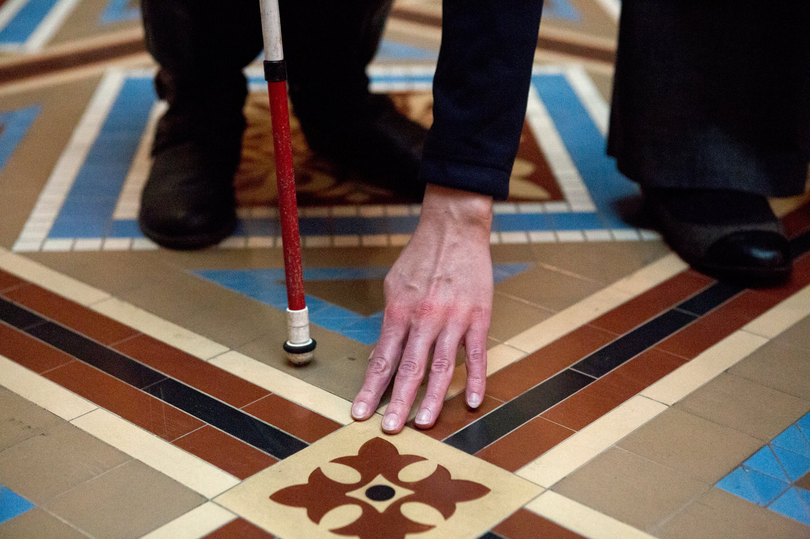

## Enhancing Visitor Experiences For Those With Visual Impairments 

During our class visit to WCMA this past Tuesday, it became clear that museums are ever changing vaults of history. As I roamed from exhibit to exhibit, it seemed as though I was entering a different time period each time. From the walls to the ceilings, each piece contributed to this sensation, but for a majority of the time, these sensations depended on my sense of sight. However, a particular exhibit at WCMA, the first one located to your right, Anicka Yi's _Our Love Is Bigger Than an Aids Quilt_, set a particulary mood for the exhibtion involving the senses of sound and smell which "immerses visitors in a sensorial experience" (1).   

(2)  

Yet, museums are _visually oriented_. Sight is the one sense we depend on the most. If that is the case, if I were to take my grandparents (both with visual impairments now) to WCMA or any other museum, how will they enjoy and interact with art? There’s a certain group of people we didn’t really discuss in class, the visually impaired. Currently, certain museums such as The Met offer workshops, audio descriptions, and tours specifically for those with visual impairments (3). Some even allow visitors to touch art pieces. 

 
(4)

Exploring senses is an innovative solution WCMA has adopted through certain exhibts. However, how can this become universal; how can we enhace experiences for the visually impaired? 

